# Prompts Documentation

This document contains the conversation history and prompts used during the development of the **current version** of the Shweep application, organized chronologically and illustrated with the captures in [`art/prompts/`](art/prompts).

It follows the same structure as the [legacy documentation](https://github.com/ViksaaSkool/Shweep/blob/feature/devbg/PROMPTS.md) from the dev.bg branch. The plan mode and build mode shown in each capture are OpenCode modes, and the labels under each prompt name the model or agent that handled it.

## Animation and Movement Polish

### Prompt 1: Smoother Sheep Movement
**User**: Asked to look at the sheep movement and work out whether the zig-zag could be made smoother, because the sheep appeared to drop frames while turning. Requested an investigation and a detailed plan first.

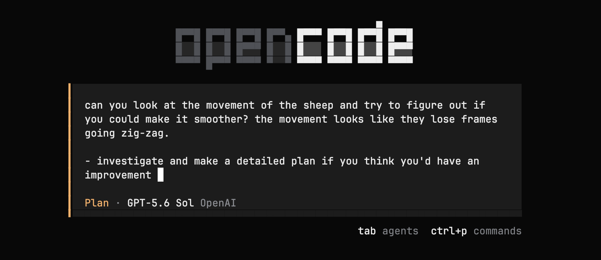
*Plan pass on the sheep simulation while the zig-zag was visibly losing frames*

### Prompt 2: Walking Legs
**User**: Asked whether the legs of the sheep could move, with animation while the sheep walk.

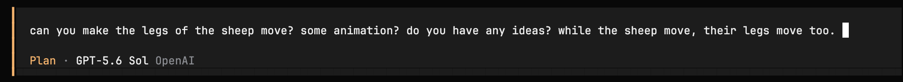
*Turning the sheep body into a layered rig with animated legs*

### Prompt 7: Sheep Size Algorithm
**User**: Asked to change the sheep size algorithm so sheep fill the screen instead of shrinking, and so that overcrowding pushes some sheep off-screen as if they drifted away from the meadow.

**Acceptance criteria**: Sheep never become microscopically small; instead they overcrowd the screen when the user swipes a lot.

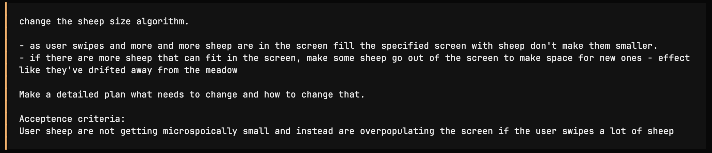
*Replacing the shrink-to-fit sizing with a fixed size plus a drift-away rule*

### Prompt 8: Zig-Zag, Then Drift Away
**User**: Asked the sheep to zig-zag for 10–15 seconds and then drift away, keeping the overcrowding rule as a fallback, so the meadow empties itself after a while with no activity.

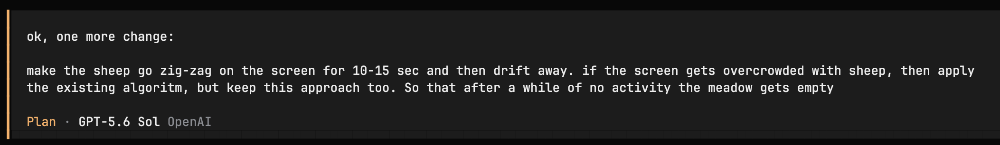
*Lifetime-based drift away combined with the existing overcrowding behaviour*

## Screens and Theming

### Prompt 3: Settings Button and Screen
**User**: Asked to add a settings button in the top right that opens a settings screen matching the app's existing design pattern, containing sheep color, Privacy Policy, Terms of Service, and Buy the developer a coffee.

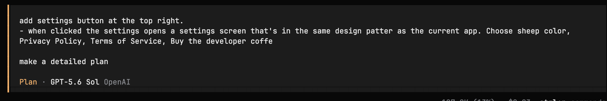
*Planning the Settings entry point and screen contents*

### Prompt 4: Clarifying Questions
**OpenCode**: Asked where the Settings button should appear, which sheep colors to offer, how the links should open, and whether final URLs or placeholders should be used.

**User answers**: Start screen only, white and black sheep, open links in the external browser, and use placeholders for the URLs.

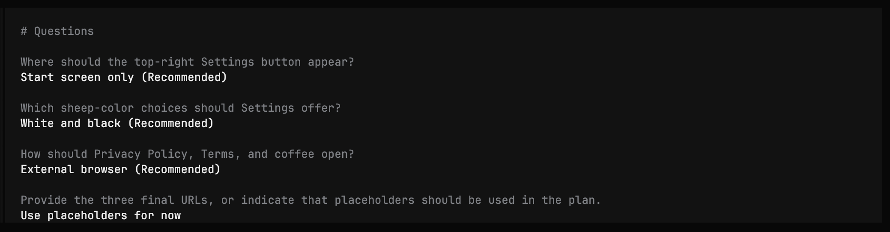
*Plan-mode questions resolved before implementation*

### Prompt 5: Black Sheep Start Background
**User**: Asked for `composeResources/drawable/background_start_black.png` to become the Start background when the user selects black sheep.

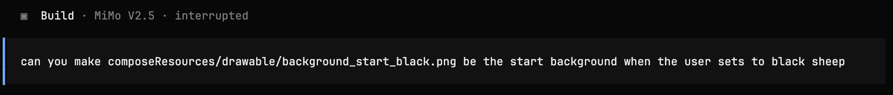
*Build pass that ties the start background to the selected sheep color*

### Prompt 6: First-Launch Sheep Color Dialog
**User**: Asked to prompt the user with a non-dismissable dialog to choose a sheep color on start up, so the user cannot continue without choosing. After the choice the prompt is never shown again, though the color can still be changed in Settings. The dialog should reuse the Settings design.

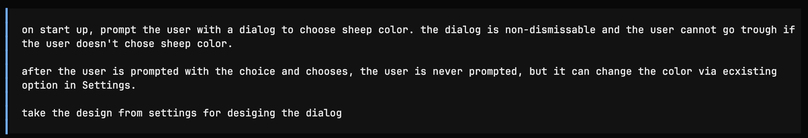
*Non-dismissable first-launch colour selection*

### Prompt 9: Settings Screen Behaviour
**User**: Asked to change the Settings behaviour so hardware back returns to the Start screen, and so changes are only applied when the user presses the Save button shown at the bottom. Pressing back with unsaved changes must discard them.

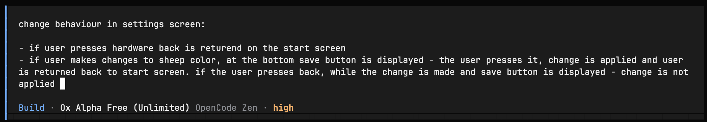
*Explicit save semantics with a hardware-back escape hatch*

## Monetization

### Prompt 10: Daily Sheep Limit
**User**: Asked to limit the number of sheep a user can swipe during a 24-hour period, resetting every day at noon in local time. The user starts with 100 sheep; if 50 or fewer are used in a period the daily amount is reduced by 10 each day until it reaches 50. If the allowance is used up, the user is prompted to buy unlimited sheep or wait until the counter restarts, with the timer displayed. Buying sheep was explicitly left for a later feature.

**Acceptance criteria**: The user has a limited amount of daily sheep.

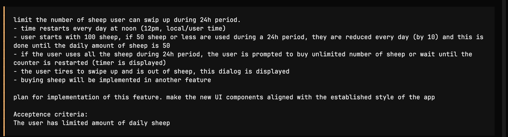
*Planning the daily allowance, noon reset, and out-of-sheep dialog*

### Prompt 11: Limited Sheep Feature Flag
**User**: Asked to plan a feature flag that must be changed in order for the limited sheep option to be applied.

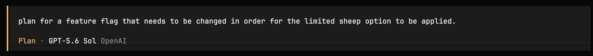
*Gating the whole allowance behind a single switch*

## History Redesign

### Prompt 12: More Appealing History Section
**User**: Asked, as a designer, how to make the history section more visually appealing and descriptive: the time should represent how long it took to fall asleep using a graphic representation in the app's style, and the number of sheep should be represented graphically.

**Acceptance criteria**: A plan for a new graphical representation that is more UI/UX friendly, detailed enough to be easy to implement.

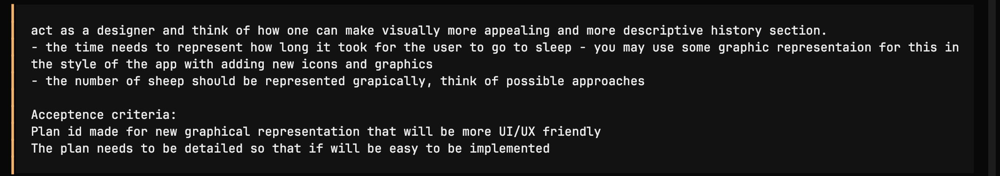
*Planning the graphical Sleepstory redesign*

## Wind-Down Behaviour

### Prompt 13: Grayscale on Inactivity
**User**: Asked to plan a feature where the user swipes sheep and, as time goes by and activity slows down, the screen goes grayscale. Returning to the Start screen must not show the grayscale effect. Asked to calculate the rate of grayscaling and the parameters to consider — frequency of swipes, user activity, and possibly a sudden drop such as gyroscope changes suggesting the user fell asleep — while trying to implement it without additional permissions if possible.

**Additional requirement**: If the phone goes to sleep, the activity is recorded as the user having gone to sleep, and when the user next returns to the app it starts from the Start screen.

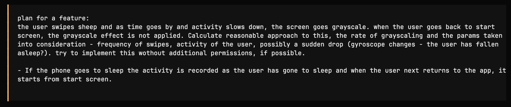
*Planning the touch-based sleepiness estimate and grayscale transition*

## Notes

- The captures show the mix of plan mode and build mode used across the session, and the different models and agents involved.
- Prompt captures are stored as `art/prompts/1.png` through `art/prompts/13.png` and are repository source artwork — they are not part of the app or website builds.
- Prompt 3 originally described the support action as “Buy the developer a coffee”. The current implementation links to Ko-fi instead, using the official Ko-fi cup mark and the “Support me on Ko-fi” label.
