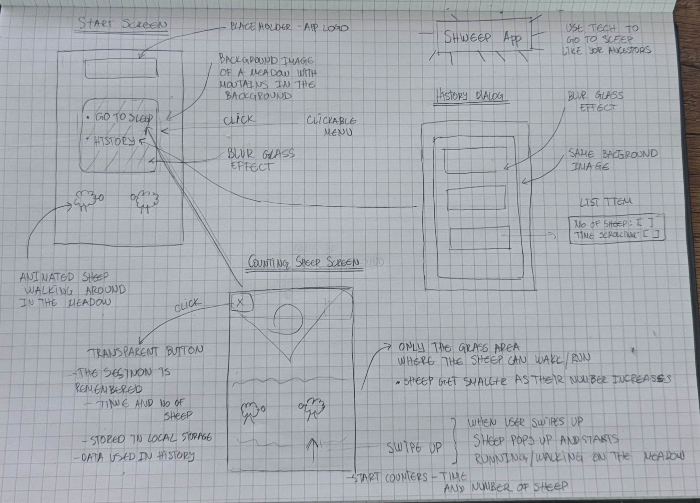
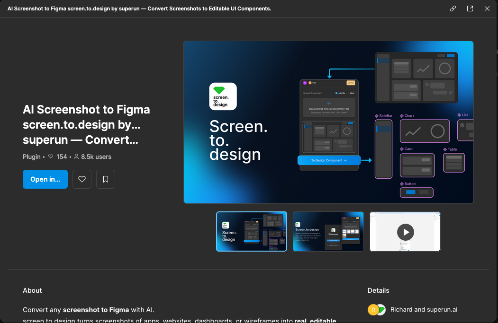
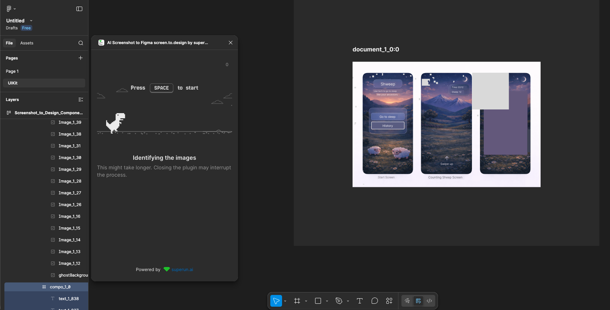
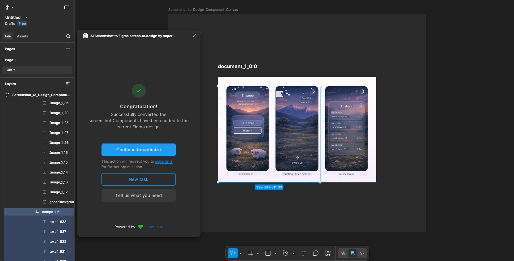
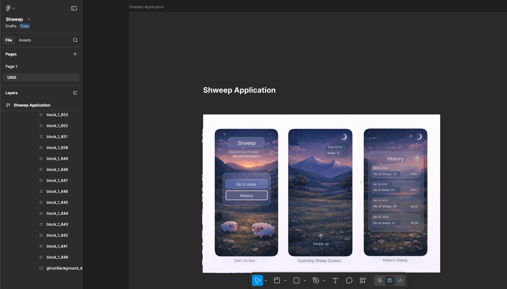
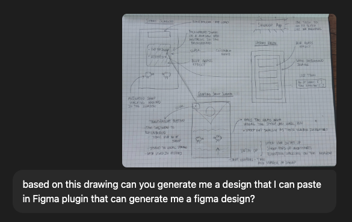
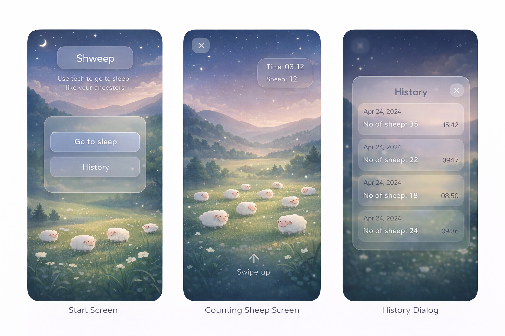
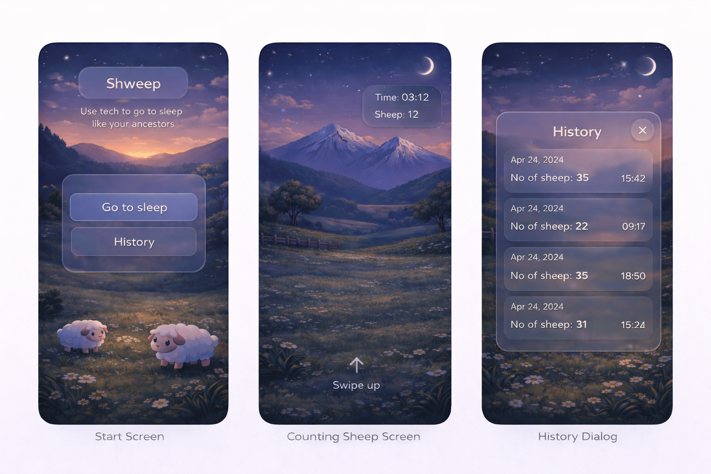
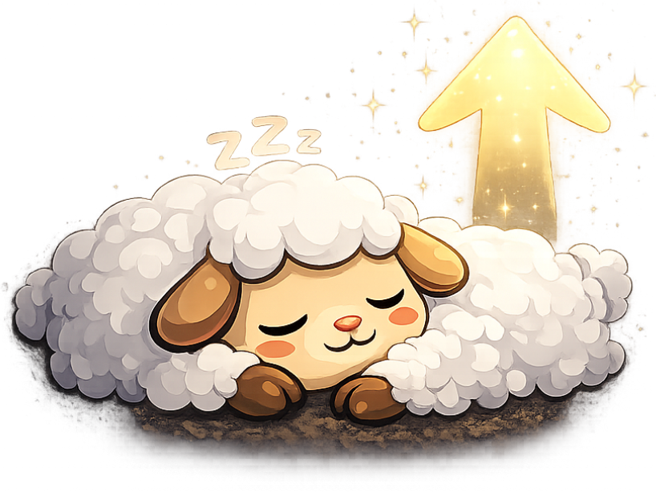
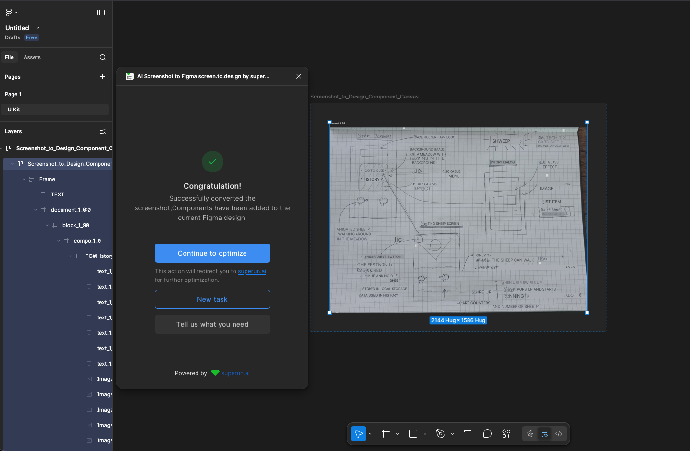

# Project Plan Documentation

This document outlines the planning phase of the Shweep application, from initial concept to finalized Figma design.

## Planning Process

### Initial Hand-Drawn Concept
The project began with a hand-drawn wireframe sketching out the core screens and user interactions.

*Original concept sketch showing Start Screen, Counting Sheep Screen, and History Dialog with annotations*

### AI-Powered Design Generation
To transform the sketch into a professional Figma design, we utilized the "AI Screenshot to Figma" plugin by superun.ai.

*The Figma plugin that converts screenshots to editable UI components*

### Design Conversion Process

#### Attempt 1: Initial Conversion
The first attempt at converting the hand-drawn sketch showed the plugin successfully identifying the layout structure.

*AI processing the hand-drawn wireframe and extracting components*

#### Attempt 2: Design Refinement
The conversion produced initial screen mockups showing the Start Screen and Counting Sheep Screen layouts.

*First iteration of the converted design showing the three main screens*

#### Attempt 3: Final Design
The final converted design shows all three screens with proper styling: Start Screen, Counting Sheep Screen, and History Dialog.

*Final converted design with complete screen flows*

### Design Iterations

#### Design Iteration 0
Early design concept with cartoon-style sheep and meadow background.

*Initial design with cute sheep characters in a meadow setting*

#### Design Iteration 1
Refined design with sunset/sunrise mountain background theme.

*Updated design featuring mountain landscape at dusk/dawn*

#### Design Iteration 2
Final design specification showing the three screens with consistent styling.

*Final design specification with Start Screen, Counting Sheep Screen, and History Dialog*

### Brand Assets

#### Logo Design
The Shweep logo features a sleeping sheep character with "Zzz" and an upward arrow.

*Shweep app logo - sleeping sheep with dreamy aesthetic*

### Failed Attempts
Not all conversion attempts were successful. Documenting failures helps track the iterative process.

*An unsuccessful conversion attempt showing partial results*

## Design Summary

The final design features:
- **Start Screen**: Welcome screen with "Go to sleep" and "History" buttons
- **Counting Sheep Screen**: Interactive screen with animated sheep, timer, and swipe-up gesture
- **History Dialog**: Modal showing past sleep sessions with sheep counts and timestamps
- **Visual Theme**: Dreamy night-time aesthetic with mountains, meadows, and cute sheep characters
