# Prompts Documentation

This document contains the conversation history and prompts used during the development of the Shweep application, organized chronologically.

## Initial Setup and Planning

### Prompt 0: Project Initialization
**User**: Initial project setup and understanding of the Shweep concept.

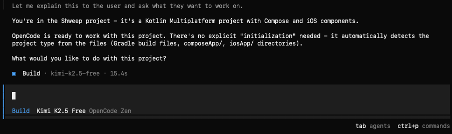
*Initial project context and OpenCode's understanding of the Kotlin Multiplatform setup*

### Prompt 1: Plan Mode Explanation
**User**: Learning about OpenCode's Plan Mode feature.

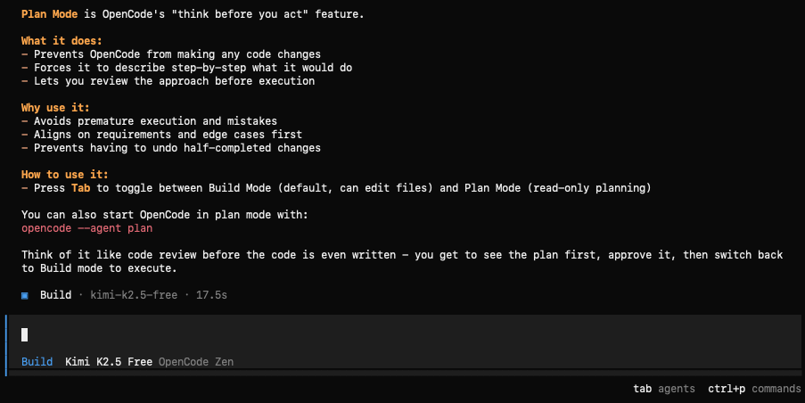
*Explanation of Plan Mode - OpenCode's "think before you act" feature for reviewing approaches before execution*

### Prompt 2: Design Understanding
**User**: Asking OpenCode to analyze and understand the Figma design.

#### Part 1: Initial Analysis
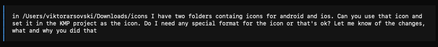
*OpenCode analyzing the Figma file structure and identifying screens and components*

#### Part 2: Component Breakdown
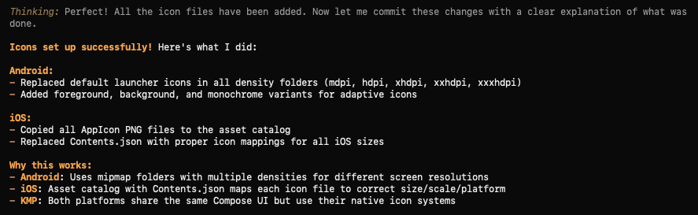
*Detailed breakdown of UI components including buttons, dialogs, and screen layouts*

## Development Phase

### Prompt 3: Start Screen Implementation
**User**: Requesting implementation of the Start Screen.

#### Part 1: Design Requirements
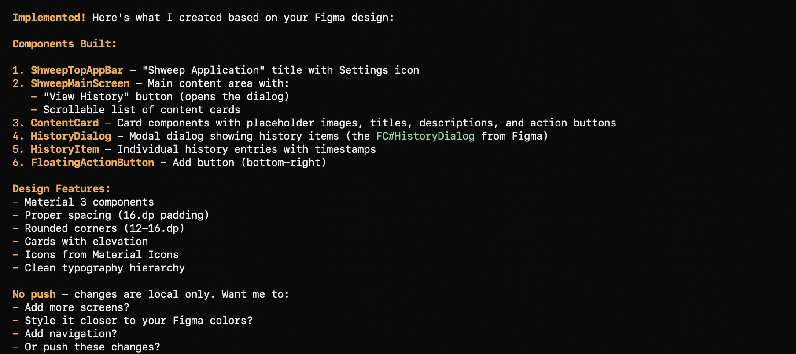
*Discussion of Start Screen requirements including background, buttons, and navigation*

#### Part 2: Implementation Details

*Technical implementation details for the Start Screen with proper styling*

### Prompt 4: Counting Sheep Screen
**User**: Developing the interactive Counting Sheep Screen.

#### Part 1: Basic Structure

*Setting up the Counting Sheep Screen with background and basic UI elements*

#### Part 2: Sheep Animation
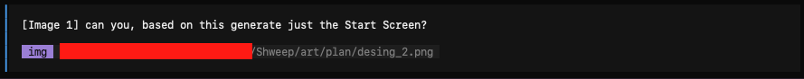
*Implementing animated sheep movement and physics*

#### Part 3: Physics System

*Collision detection and movement boundaries for the sheep*

#### Part 4: User Interactions

*Swipe gesture detection and sheep spawning mechanics*

#### Part 5: Fine-tuning

*Adjusting animation speeds, boundaries, and visual feedback*

### Prompt 5: History Feature
**User**: Implementing the session history functionality.

#### Part 1: Data Storage
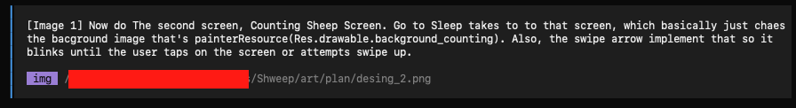
*Setting up DataStore for persistent session storage*

#### Part 2: History Dialog

*Creating the History Dialog UI with real data display*

### Prompt 6: DataStore Implementation
**User**: Adding persistent storage for sleep sessions.

#### Part 1: Repository Setup
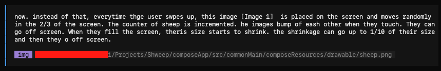
*Creating the Session data class and repository pattern*

#### Part 2: Android Implementation

*Android-specific DataStore implementation*

#### Part 3: iOS Implementation

*iOS-specific DataStore implementation with proper file paths*

#### Part 4: Session Management

*Integrating session save/load with the Counting Sheep Screen lifecycle*

### Prompt 7: Bug Fixes
**User**: Addressing issues with session persistence.

#### Part 1: Session Not Saving
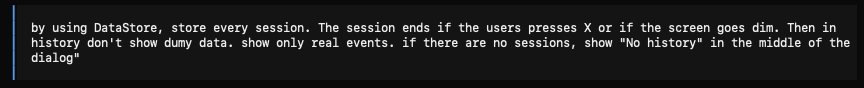
*Debugging why only the first session was being saved*

#### Part 2: Async Issues

*Identifying coroutine cancellation issues during screen disposal*

#### Part 3: Solution Implementation
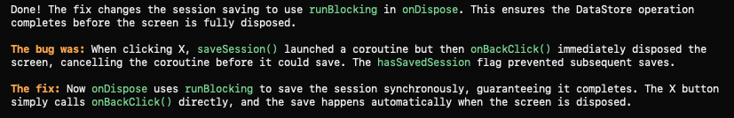
*Implementing runBlocking to ensure session saves complete before disposal*

## Finalization

### Prompt 8: MVP Completion
**User**: Finalizing the MVP and creating documentation.

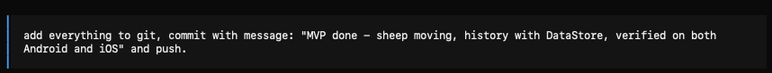
*Final commit with complete MVP features including sheep animation, DataStore integration, and cross-platform verification*

## Key Development Decisions

Throughout the prompts, several important decisions were made:

1. **Architecture**: Kotlin Multiplatform with Compose for shared UI
2. **Storage**: DataStore for cross-platform persistent storage
3. **Animation**: Custom physics-based sheep movement with collision detection
4. **Design Integration**: Figma MCP for direct design-to-code workflow
5. **Session Management**: Automatic session saving on screen disposal or back navigation

## Learning Outcomes

The prompt history demonstrates:
- Effective use of AI-assisted development
- Iterative refinement of features
- Problem-solving approach to bugs
- Cross-platform development best practices
- Integration of design tools with code generation
