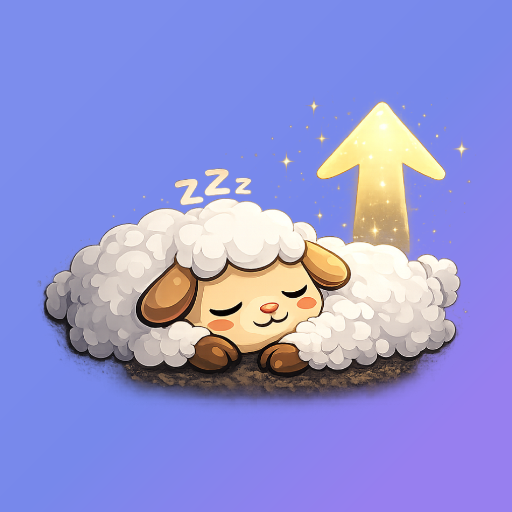
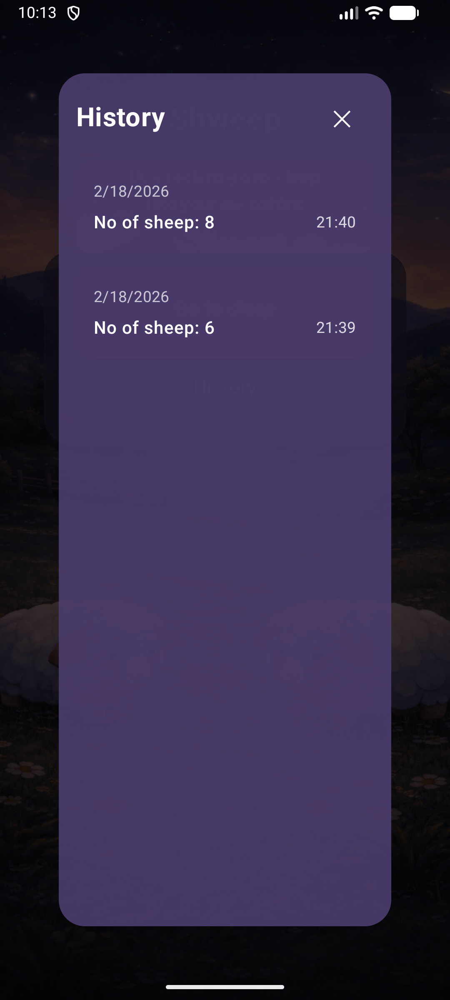

# Shweep app

Go to sleep like your ancestors did with a proven method and stop doom scrolling! 
Now with Shweep **(Sheep, Sleep, Swipe)** you can swipe sheep and go to sleep. 
Technology meets tradition.

# Demo 

  

# About 

The app is part of the talk [for dev.bg](https://d.dev.bg/mverwxy8)

# Implementation

For implementation switch branches and go to `develop_opencode_kimi` branch to see the vibe engineering details 
with the help of OpenCode and Kimi 2.5 or click [here](https://github.com/ViksaaSkool/Shweep/tree/develop_opencode_kimi).

# License

This project is licensed under the MIT License - see the [LICENSE.md](LICENSE.md) file for details. 