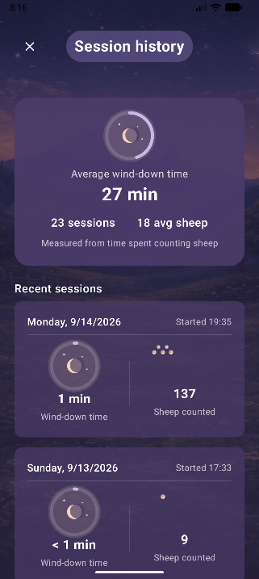

# Shweep app


Go to sleep like your ancestors did with a traditional sheep-counting ritual designed to help you wind down — and stop doom scrolling! 
Now with Shweep **(Sheep, Sleep, Swipe)** you can swipe sheep and go to sleep. 
Technology meets tradition.

# Demo 

   


# About 

The legacy version of the app is part of the talk [for dev.bg](https://d.dev.bg/mverwxy8)


For more context see [the branch dedicated for that session](https://github.com/ViksaaSkool/Shweep/tree/feature/devbg)


The current version of the app is part of the talk [for Droidcon Lisbon 26](https://x.com/droidconLisbon/status/2089261109689643248)


# Documentation

For context first go through [legacy documentation](https://github.com/ViksaaSkool/Shweep/tree/feature/devbg#documentation) of the app and look into the [PLAN](https://github.com/ViksaaSkool/Shweep/blob/feature/devbg/PLAN.md), [SETUP](https://github.com/ViksaaSkool/Shweep/blob/feature/devbg/SETUP.md) and [PROMPTS](https://github.com/ViksaaSkool/Shweep/blob/feature/devbg/PROMPTS.md)

The development history of the current version is documented in [DCLX26_PROMPTS.md](DCLX26_PROMPTS.md), based on the prompt captures in `art/prompts/`. The Google Play and App Store listing graphics were designed with [Pen.dev](https://www.pen.dev/) — see [STORE_DESIGNS.md](STORE_DESIGNS.md). Local signed Android builds are covered in [BUILD_LOCAL_ANDROID.md](BUILD_LOCAL_ANDROID.md); automated Play publishing is covered in [PUBLISH_ANDROID.md](PUBLISH_ANDROID.md).

# Features

- 🐑 **Interactive Sheep Meadow**: Swipe up to flick a sheep into the meadow, or drag and drop one where you want it. Sheep move with a physics-based zig-zag, collide with each other, and drift away after 10–15 seconds so the meadow never overcrowds.
- 🦵 **Layered, Animated Sheep**: Each sheep is drawn from separate body and leg bitmaps, so the legs actually step while the sheep walk and the body bobs with the gait.
- 🌗 **Grayscale Wind-Down**: As your swiping slows down, the counting scene gradually loses color. A successful swipe brings the color back, and the Start screen always stays fully colored.
- 📖 **Sleepstory (Redesigned History)**: A graphical summary with the average wind-down time, a duration arc, and a mini sheep flock, plus per-session cards showing when you started, how long you counted, and how many sheep you counted.
- 🎨 **Sheep Color Choice**: Pick white or black sheep in Settings. Black sheep also switches the Start screen to the dark night background, and a first-launch, non-dismissable dialog makes the initial choice.
- ⚙️ **Settings**: Sheep color, Privacy Policy, Terms of Service, and Invite friends. Changes apply only when you tap Save.
- ⏱️ **Session Tracking**: A session starts on “Go to sleep”, is checkpointed locally, ends after roughly 10 seconds in the background, and is recovered if the app is closed mid-session.
- 💾 **Local Persistence**: Sessions, the active-session checkpoint, and preferences are stored with multiplatform DataStore. No account and no backend.
- 🐏 **Daily Sheep Allowance** *(feature-flagged, currently disabled)*: A daily allowance that resets at local noon. The feature is turned off, so the app hands out unlimited sheep. This version has no in-app purchases.
- 📲 **Cross-Platform**: One Kotlin Multiplatform / Compose Multiplatform codebase for Android and iOS.
- 🌐 **Legal Pages**: Privacy Policy and Terms of Service published on GitHub Pages at [shweep.lol](https://shweep.lol/).

# Repository layout

This repository ships two deliverables that must stay separated:

| Path | Purpose | Ships where |
|------|---------|-------------|
| `composeApp/src/**` | KMP app code and packaged resources | Android / iOS app |
| `iosApp/iosApp/**` | iOS app sources and assets | iOS app |
| `docs/**` | GitHub Pages website (pages, video, poster) | GitHub Pages only |
| `art/**` | Repository source artwork (demo shots, animation layers) | GitHub only (not packaged) |
| `tools/**` | Repo tooling (renderer, asset guard) | GitHub only |

Website files (`.html`, `.css`, `.mp4`, `.webm`, `landing-*`), symlinks, and any
byte-identical copy of an `art/` or `docs/` file must never appear inside the
app source sets or inside a packaged APK/AAB/`.app` bundle.

Guards:

- `tools/web_asset_guard.py check-source` fails if website assets, renamed
  copies of `art/`/`docs/` files, or symlinks are found in app build inputs,
  or if a Gradle/Xcode source directory is redirected into `art/` or `docs/`.
- `tools/web_asset_guard.py check-pages` fails if the Pages artifact would
  include anything other than `docs/`, or if a docs page references files
  outside `docs/`.
- `tools/web_asset_guard.py check-archive <apk|aab|.app>` fails if website
  assets are found inside a built artifact.
- `tools/web_asset_guard.py self-test` verifies the guard detects violations
  using synthetic fixtures.
- `.github/workflows/web-asset-boundary.yml` runs all of the above on GitHub,
  and additionally builds the debug APK, release AAB, and an iOS simulator
  `.app`, then inspects each artifact.

Regenerating the landing background video:

```sh
python3 tools/render_background_frames.py
# then re-encode with ffmpeg (see script header)
```

# Download


# License

This project is licensed under the MIT License - see the [LICENSE.md](LICENSE.md) file for details. 