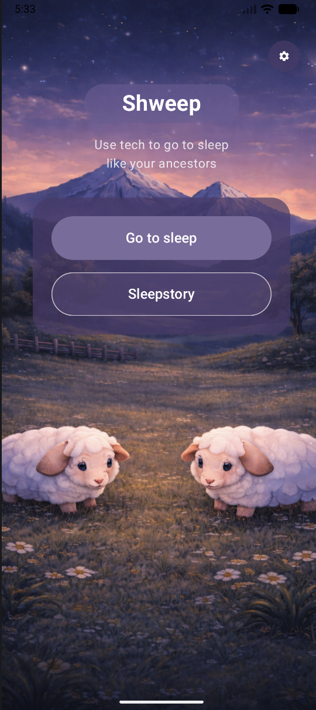
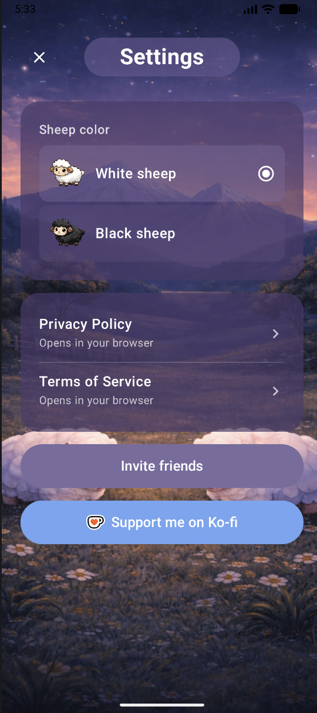

# Shweep app


Go to sleep like your ancestors did with a proven method and stop doom scrolling! 
Now with Shweep **(Sheep, Sleep, Swipe)** you can swipe sheep and go to sleep. 
Technology meets tradition.

# Demo 

  


# About 

The app is part of the talk [for dev.bg](https://d.dev.bg/mverwxy8)


# Implementation

For implementation switch branches and go to `feature/devbg` branch to see the vibe engineering details 
with the help of OpenCode and Kimi 2.5 or click [here](https://github.com/ViksaaSkool/Shweep/tree/feature/devbg).

# Repository layout

This repository ships two deliverables that must stay separated:

| Path | Purpose | Ships where |
|------|---------|-------------|
| `composeApp/src/**` | KMP app code and packaged resources | Android / iOS app |
| `iosApp/iosApp/**` | iOS app sources and assets | iOS app |
| `docs/**` | GitHub Pages website (pages, video, poster) | GitHub Pages only |
| `art/**` | Repository source artwork (demo shots, animation layers) | GitHub only (not packaged) |
| `tools/**` | Repo tooling (renderer, asset guard) | GitHub only |

Website files (`.html`, `.css`, `.mp4`, `.webm`, `landing-*`), symlinks, and any
byte-identical copy of an `art/` or `docs/` file must never appear inside the
app source sets or inside a packaged APK/AAB/`.app` bundle.

Guards:

- `tools/web_asset_guard.py check-source` fails if website assets, renamed
  copies of `art/`/`docs/` files, or symlinks are found in app build inputs,
  or if a Gradle/Xcode source directory is redirected into `art/` or `docs/`.
- `tools/web_asset_guard.py check-pages` fails if the Pages artifact would
  include anything other than `docs/`, or if a docs page references files
  outside `docs/`.
- `tools/web_asset_guard.py check-archive <apk|aab|.app>` fails if website
  assets are found inside a built artifact.
- `tools/web_asset_guard.py self-test` verifies the guard detects violations
  using synthetic fixtures.
- `.github/workflows/web-asset-boundary.yml` runs all of the above on GitHub,
  and additionally builds the debug APK, release AAB, and an iOS simulator
  `.app`, then inspects each artifact.

Regenerating the landing background video:

```sh
python3 tools/render_background_frames.py
# then re-encode with ffmpeg (see script header)
```

# License

This project is licensed under the MIT License - see the [LICENSE.md](LICENSE.md) file for details. 