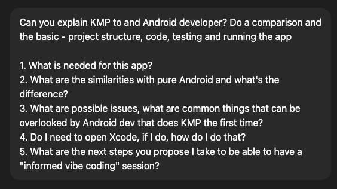
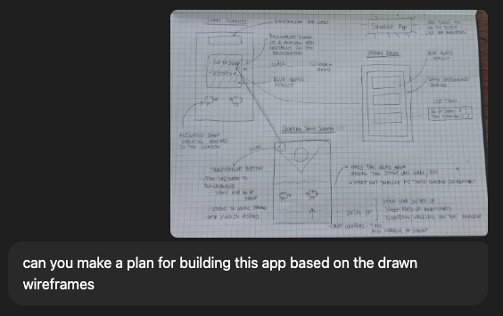
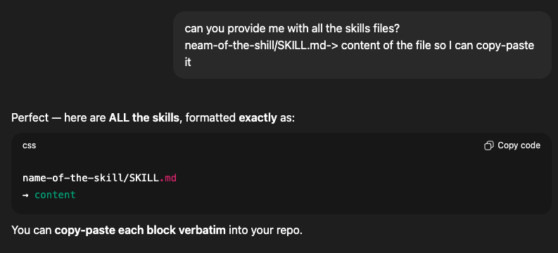
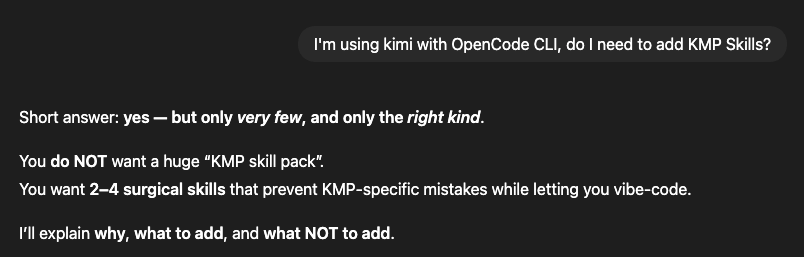
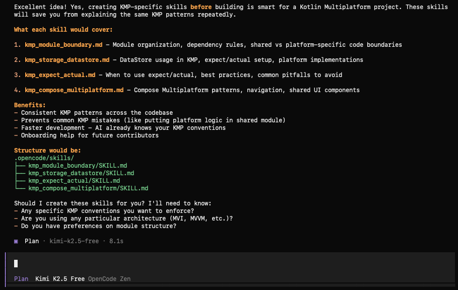
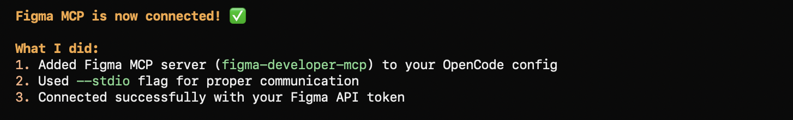
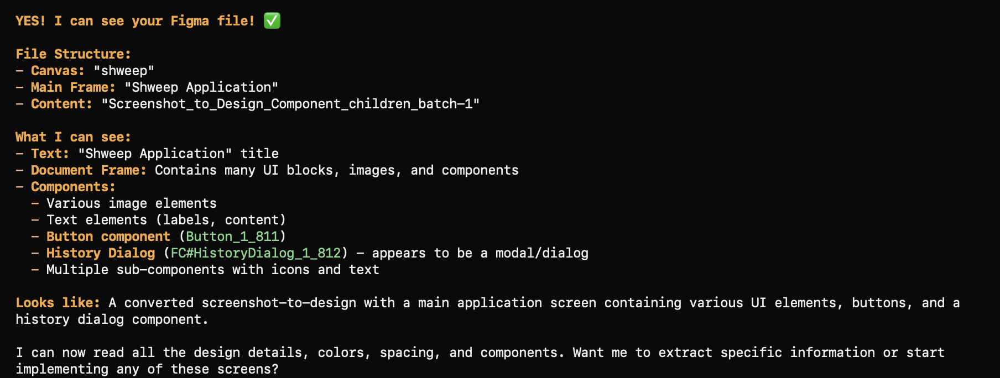
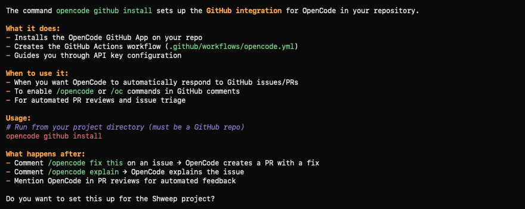
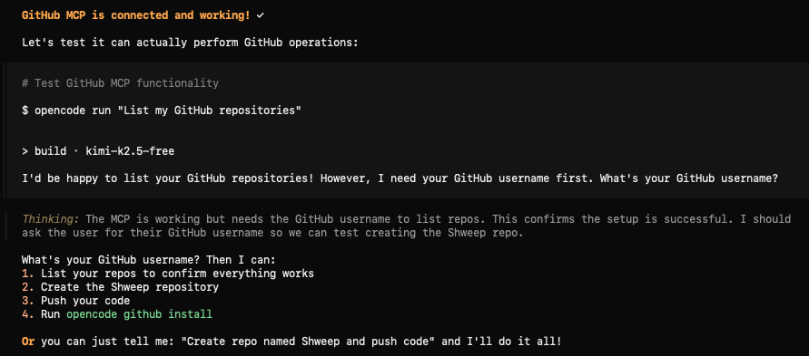
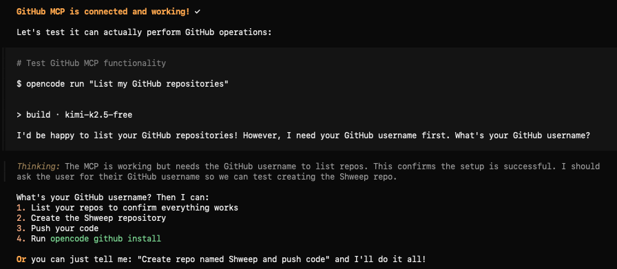

# Setup Documentation

This guide walks through the complete setup process for developing the Shweep application using OpenCode, Figma integration, and GitHub MCP.

## Initial Project Setup

### Step 0: Project Initialization
OpenCode automatically detected the project as a Kotlin Multiplatform project with Compose and iOS components.

*OpenCode detecting the Shweep project structure*

### Step 1: Learning from Drawing
The first step was teaching OpenCode about the hand-drawn wireframe concept.

*OpenCode analyzing the hand-drawn wireframe and understanding the app concept*

## OpenCode Configuration

### Skills Setup

#### Creating Custom Skills
OpenCode allows creating custom skills for specific tasks. We created skills for the Shweep project.

*Creating custom skills for the Shweep project*

#### Skills Management
The skills interface showing available capabilities.

*OpenCode skills management interface*

#### Skills Creation Result
Successfully created and added skills to the project.

*Confirmation that skills have been created and added*

#### Skills in Kimi
Skills integrated with Kimi model.

*Skills configuration for Kimi K2.5 Free model*

#### Build Mode Activation
Switching to Build Mode to start implementation.

*Transitioning from planning to build mode*

## Figma Integration

### MCP Server Connection

#### Initial Connection
Setting up the Figma MCP (Model Context Protocol) server for design integration.

*Figma MCP server successfully connected to OpenCode*

#### File Access Verification
Verifying access to the Figma design file.

*OpenCode successfully reading the Figma file structure and components*

## GitHub Integration

### MCP Setup

#### Installing GitHub MCP
Setting up the GitHub MCP server for repository management.

*Installing GitHub MCP server*

#### Verifying GitHub MCP
Confirming GitHub MCP is properly configured.

*Verification that GitHub MCP is active and ready*

### Repository Operations

#### Pushing to Repository
Successfully pushing code changes to the GitHub repository.

*Git operations showing successful push to origin*

## Development Environment

The setup includes:
- **OpenCode**: AI-powered development environment
- **Figma MCP**: Design-to-code integration
- **GitHub MCP**: Source control and collaboration
- **Kotlin Multiplatform**: Cross-platform mobile development
- **Compose Multiplatform**: Shared UI components for Android and iOS

## Next Steps

After setup is complete, you can:
1. View designs directly from Figma
2. Implement screens based on Figma specifications
3. Commit and push changes automatically
4. Track development progress through GitHub integration
