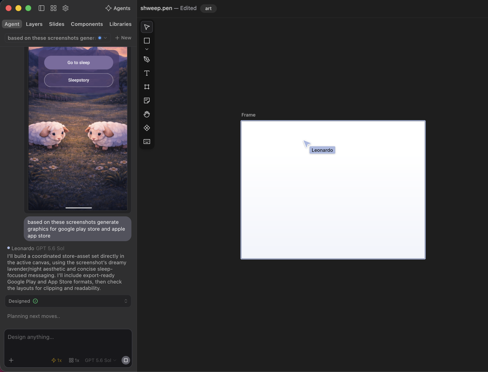
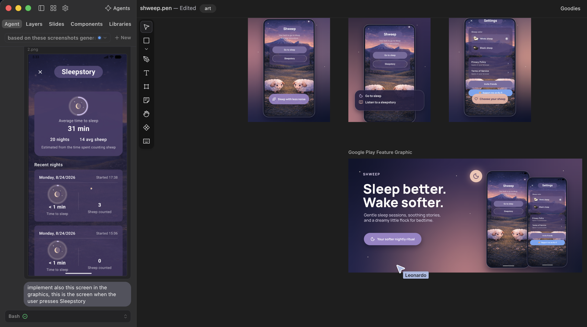
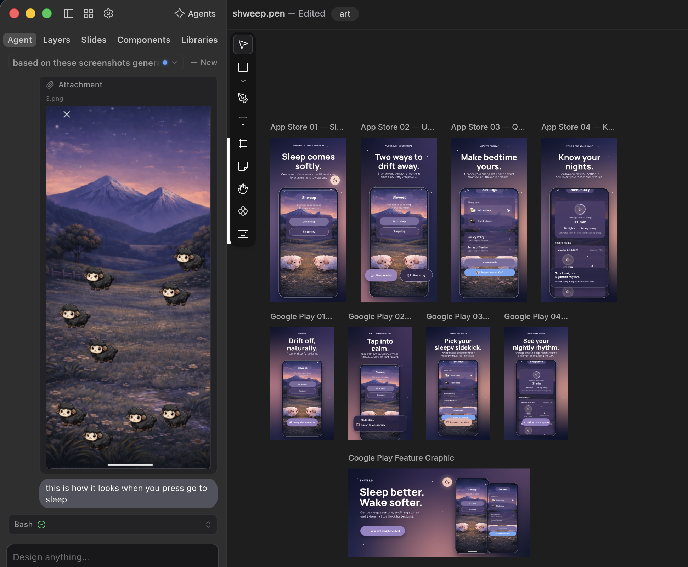
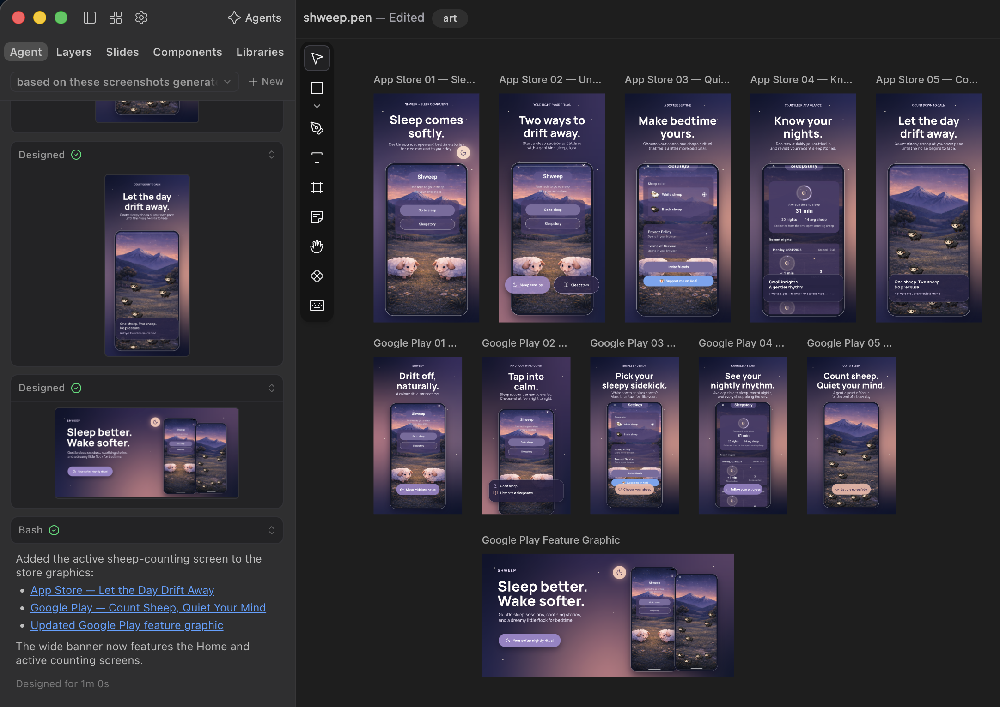

# Store Designs

This document explains how the **Google Play** and **App Store** listing graphics for Shweep were created, and what the Pen.dev captures in [`art/prompts/14.png`](art/prompts/14.png) through [`art/prompts/17.png`](art/prompts/17.png) show.

## The tool: Pen.dev

The store assets were designed with **[Pen.dev](https://www.pen.dev/)** (formerly Pencil.dev) — an agentic design canvas for building software visuals.

Pen.dev is a desktop design app where AI agents work directly on the canvas alongside you. Key points relevant to this project:

- **Agentic canvas**: you prompt an agent and it creates real, editable layers on the canvas instead of returning a flat image.
- **Bring any model**: it works with Claude, OpenAI, Gemini, Kimi, DeepSeek, Qwen, Grok and others, or via a ChatGPT/Claude subscription or API keys.
- **Import everything**: `.fig` (Figma) files, any webpage through the built-in browser or Chrome extension, and HTML — imported as editable layers.
- **Open `.pen` format**: the canvas is stored as JSON, so agents can read and modify it natively.
- **Export-ready output**: any frame can be exported as PNG, JPEG, WEBP or PDF at 1x, 2x, 3x.

For Shweep, this meant the store graphics could be generated from the app's own screenshots and kept consistent with the app's dreamy lavender/night aesthetic, without hand-rebuilding each store format.

## How the store resources were created

The workflow used one Pen.dev file, `shweep.pen`:

1. **Attach the app screenshots** to the agent as references on the canvas.
2. **Prompt the agent** to generate a coordinated set of store graphics for both stores from those references.
3. **Iterate screen by screen**, attaching additional screens (Sleepstory, the counting screen) and asking for them to be added to the set.
4. **Export** the finished frames as the App Store and Google Play assets plus the Play feature graphic.

The captures below document that process in order.

## Screenshot walkthrough

### `14.png` — Kick-off: generate the store set

The Pen.dev window with `shweep.pen` open. The Sleepstory screen is attached to the agent, and the prompt reads:

> *based on these screenshots generate graphics for google play store and apple app store*

The agent **Leonardo (GPT-5.6 Sol)** replies that it will build a coordinated store-asset set directly in the active canvas, using the screenshot's dreamy lavender/night aesthetic and concise sleep-focused messaging, including export-ready Google Play and App Store formats, then check the layouts for clipping and readability. The canvas shows the first empty frame being created.

### `15.png` — First generated set

The agent (**Bash**) has produced the first pass: three phone mockups (the Start screen with its action menu, the Settings screen, and the Sleepstory screen) plus the wide **Google Play Feature Graphic**.

The Sleepstory screen is attached with the prompt:

> *implement also this screen in the graphics, this is the screen when the user presses Sleepstory*

The feature graphic already carries the final taglines: **"Sleep better. Wake softer."** with *"Gentle wind-down sessions, nightly insights, and a dreamy little flock for bedtime."*

### `16.png` — Adding the counting screen

The canvas now holds a grid of portrait store assets — App Store 01–04 and Google Play 01–04 — plus the feature graphic. The black-sheep counting screen is attached with the prompt:

> *this is how it looks when you press go to sleep*

so the active counting screen is included in the store set.

### `17.png` — Final set

The finished canvas: **five App Store assets, five Google Play assets, and the updated Google Play feature graphic**. The agent notes:

> *Added the active sheep-counting screen to the store graphics: App Store — Let the Day Drift Away; Google Play — Count Sheep, Quiet Your Mind; Updated Google Play feature graphic. The wide banner now features the Home and active counting screens.*

## Generated assets

**App Store screenshots** (portrait)

| # | Headline | Focus |
|---|----------|-------|
| 01 | Sleep comes softly. | Start screen |
| 02 | Two ways to drift away. | Sleep session options |
| 03 | Make bedtime yours. | Settings, sheep color, support |
| 04 | See your wind-down rhythm. | Locally stored session history |
| 05 | Let the day drift away. | Active counting screen |

**Google Play screenshots** (portrait)

| # | Headline | Focus |
|---|----------|-------|
| 01 | Drift off, naturally. | Start screen |
| 02 | Tap into calm. | Sleep session options |
| 03 | Pick your sleepy sidekick. | Sheep color |
| 04 | See your wind-down rhythm. | Locally stored session history |
| 05 | Count sheep. Quiet your mind. | Active counting screen |

**Google Play feature graphic** (wide banner)

> **Sleep better. Wake softer.**
> Gentle wind-down sessions, nightly insights, and a dreamy little flock for bedtime.
> *Your softer nightly ritual*

## Notes

> The 1.x screenshot set above does not show the 35-sheep allowance, the cooldown dialog, Colorful Sheep, or the independent Upgrades card. It must not be treated as a complete 2.0 store-asset set. See `STORE_NOTES.md` for the recommended 2.0 screenshots.

- The captures in `art/prompts/` document the creation process; they are repository source artwork and are not part of the app or website builds.
- The store listing assets themselves are uploaded to Google Play Console and App Store Connect, not committed to this repository.
- The Session history assets were revised for accuracy: Session history is counting-session history, not bedtime stories, and the graphics no longer claim the app measures time to sleep. Any "soothing stories" or "time to sleep" wording still visible in the `art/prompts/` captures is the pre-revision copy.
